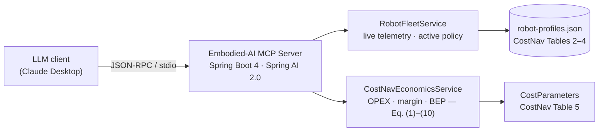

# Embodied-AI MCP Server

**A cost-aware agent harness that lets an LLM inspect a physical delivery robot and reason about its economic viability — grounded in the [CostNav](https://arxiv.org/abs/2511.20216) benchmark.**

Built with Spring Boot 4 and Spring AI 2.0; exposes its capabilities to any
[Model Context Protocol](https://modelcontextprotocol.io) client (e.g. Claude
Desktop) over stdio.

---

## Motivation

Embodied-navigation research scores agents on **task success** — success rate,
collision rate, path length, navigation time. CostNav (Seong et al., 2026; SNU /
MAUM.AI / KAIST / UC Irvine) argues that these metrics are *disconnected from the
economics of real-world deployment*: across seven rule-based and learning-based
baselines, **every method yields a negative contribution margin** once you price
in electricity, repairs, delivery refunds, pedestrian-injury liability and
property damage. High task success does not imply commercial viability.

Separately, LLM agents are increasingly the *decision layer* over physical
systems — but an LLM can only act on a system it can **observe and query**. The
open engineering question is less "can the model reason?" and more "**how do we
expose physical-world state and domain models to the model as reliable tools?**"

This project sits at that intersection. It takes CostNav's economic model and
turns it into an **MCP tool surface**: the LLM queries live robot telemetry and a
physics-grounded cost breakdown, then reasons about what behaviour to change to
minimise loss per delivery. It is a deliberately small, verifiable study in
**agent-harness engineering** — connecting an LLM to physical-world data and
domain models — rather than a robotics-hardware contribution.

---

## Architecture



The LLM never sees the formulas — only **tools**. It composes them to answer
open-ended questions such as *"Compare every policy and tell me which loses the
least money per delivery, and why."* The economic reasoning is delegated to a
verifiable Java service; the LLM orchestrates and explains.

---

## The 6 MCP tools

| Tool | Returns | Grounded in |
|------|---------|-------------|
| `get_robot_status` | Live telemetry: active policy, battery, position, distance/runtime, per-run collision log | Sim logs (Table 2) |
| `list_navigation_policies` | All 7 baselines with SLA, OPEX and contribution margin | Table 3 |
| `set_active_policy` | Switches the robot's navigation policy; returns the new state | — |
| `get_opex_breakdown` | Per-run OPEX split into the 5 CostNav categories + dominant cost driver | §3.1.3, Eq. (6)–(10) |
| `get_economic_viability` | CAPEX, OPEX, revenue, contribution margin, break-even point | Eq. (1)–(3) |
| `recommend_navigation_policy` | Least-loss policy + concrete behaviours to cut OPEX | §4.2 |

---

## Why MCP (design rationale)

- **Separation of concerns.** The cost model is deterministic and unit-tested in
  Java; the LLM is responsible only for orchestration and natural-language
  explanation. Numbers never depend on the model "doing math".
- **Composability.** Each tool is a single, well-typed capability. Open-ended
  questions emerge from the model composing tools, not from bespoke endpoints.
- **Transport-agnostic + portable.** stdio works with Claude Desktop today and
  any future MCP client; nothing is tied to one vendor's function-calling format.
- **Auditable tool I/O.** Every call is structured JSON, so a reviewer can verify
  exactly what the model saw and returned.

---

## The economic model — and why it is faithful

The server **recomputes** each cost component from CostNav's real-world
parameters (Table 5: U.S. SEC filings, AIS injury reports, commercial delivery
pricing) rather than hard-coding outputs. For example:

- **Service compensation** `= spoiled · $31.93 + (timeout + physAssist) · $3.49` — Eq. (8)
- **Repair** `= (P_robot / 18250) · 0.15 · (physAssist / 0.002)` — Eq. (7)
- **Revenue** `= $3.49 · SLA`,  **Contribution margin** `= Revenue − OPEX` — Eq. (1)–(2)

These reproduce the paper's published figures **to the decimal**, asserted by
[`CostNavEconomicsServiceTest`](src/test/java/ai/costnav/mcp/CostNavEconomicsServiceTest.java):

| Policy | OPEX/run | Revenue/run | Contribution margin | Paper (Table 3) |
|--------|---------:|------------:|--------------------:|----------------:|
| CANVAS (RGB + GPS) | $30.85 | $2.44 | **−$28.40** | −$28.40 ✓ |
| Nav2 w/ AMCL (LiDAR) | $45.57 | $1.50 | **−$44.07** | −$44.07 ✓ |
| NavDP (least loss) | $15.75 | $0.00 | **−$15.75** | −$15.75 ✓ |

> **No baseline is economically viable** — CostNav's headline finding. The server
> reports loss-minimisation, never fabricated profitability.

---

## Demo: an LLM reasoning about robot economics

A representative Claude Desktop session (tool calls + verbatim server responses):

> **User:** How is the delivery robot doing economically right now?

🔧 `get_robot_status` →
```json
{ "activePolicyName": "CANVAS (RGB + GPS)", "batteryPercent": 72.0,
  "position": {"x":120.0,"y":60.0}, "collisionsThisRun": 2,
  "recentCollisions": [
    {"obstacleType":"pedestrian","deltaVMps":0.41,"estimatedCostUsd":14.38},
    {"obstacleType":"property_infrastructure","deltaVMps":0.21,"estimatedCostUsd":6.0}]}
```
🔧 `get_economic_viability` →
```json
{ "opexPerRunUsd": 30.85, "revenuePerRunUsd": 2.44,
  "contributionMarginUsd": -28.40, "economicallyViable": false,
  "breakEvenRuns": null,
  "verdict": "NOT economically viable: each delivery loses $28.40 ..." }
```
🔧 `get_opex_breakdown` → `largestComponent: "pedestrianSafety" ($14.38/run)`

> **Claude:** The robot is running the CANVAS policy and is operational (72%
> battery), but it is **losing $28.40 per delivery** — revenue is $2.44/run
> against $30.85/run of OPEX. The dominant cost is **pedestrian-safety liability
> ($14.38/run)**, which scales with collision impact speed; this run already
> logged a pedestrian contact at 0.41 m/s. The highest-leverage fix is reducing
> impact delta-v near pedestrians. Per CostNav, *no* available policy is
> profitable — the least-loss option is NavDP at −$15.75/run.

> 📸 *Add your Claude Desktop screenshot at `docs/demo.png` and it will render here.*

Reproduce the full tool exchange without Claude Desktop:

```bash
python scripts/smoke_test.py
```

---

## Quickstart

**Requirements:** Java 17+ (no Gradle install needed — uses the wrapper).

```bash
./gradlew bootJar      # 1. build the executable jar   (Windows: gradlew.bat bootJar)
./gradlew test         # 2. verify it reproduces the paper's economics
python scripts/smoke_test.py   # 3. end-to-end MCP handshake + all 6 tools
```

### Connect to Claude Desktop

Add to `%APPDATA%\Claude\claude_desktop_config.json` (Windows) or
`~/Library/Application Support/Claude/claude_desktop_config.json` (macOS) — see
[`docs/claude_desktop_config.example.json`](docs/claude_desktop_config.example.json):

```json
{
  "mcpServers": {
    "embodied-ai-costnav": {
      "command": "java",
      "args": ["-jar", "/absolute/path/to/embodied-ai-mcp-server-0.0.1-SNAPSHOT.jar"]
    }
  }
}
```

Restart Claude Desktop, then ask: *"How is the delivery robot doing economically?"*

---

## Project structure

```
src/main/java/ai/costnav/mcp/
├── config/CostParameters.java        # CostNav Table 5 cost parameters
├── model/                            # records: profiles, state, OPEX, viability…
├── service/
│   ├── RobotFleetService.java        # loads policies, holds state, synthesizes telemetry
│   └── CostNavEconomicsService.java  # OPEX / revenue / margin / BEP — Eq. (1)–(10)
└── tools/RobotStatusTools.java       # @McpTool surface (6 tools)
src/main/resources/
├── robot-profiles.json               # 7 baselines, CostNav Tables 2–4
└── logback-spring.xml                # file-only logging (stdout reserved for MCP)
```

## Scope: what this is, and isn't

- **Paper-faithful economics.** Every monetary figure is recomputed from CostNav's
  parameters and verified against Table 3 by tests.
- **Operational layer (this project's addition).** Battery level and map position
  are *not* CostNav metrics — CostNav explicitly lists battery depletion as
  out-of-scope (§6). They are surfaced here as a clearly-labelled operational
  extension, not claimed as paper results.
- **Measured-in-sim inputs.** Pedestrian-safety cost (AIS model, Eq. 9) and
  property-damage cost (Eq. 10) are taken as per-policy measured values; the other
  three OPEX components are recomputed from first principles.
- **Not a simulator.** This does not run Isaac Sim or control a robot; it models
  the *economic-reasoning interface* a deployed agent would query.

## Extending

- **Add a navigation policy:** append an entry to `robot-profiles.json`.
- **Add a cost term:** extend `CostNavEconomicsService` + `OpexBreakdown`.
- **Add a tool:** add an `@McpTool`-annotated method to `RobotStatusTools`; Spring
  AI auto-registers it.

Natural next steps: a battery-depletion failure mode (CostNav §6 future work), a
break-even scenario calculator for hypothetical "viable" cost structures, and a
demand/dynamic-pricing revenue model.

## Citation

```bibtex
@article{seong2026costnav,
  title   = {CostNav: A Navigation Benchmark for Real-World Economic-Cost
             Evaluation of Physical AI Agents},
  author  = {Seong, Haebin and others},
  journal = {arXiv preprint arXiv:2511.20216},
  year    = {2026}
}
```

This repository is an independent educational reimplementation of CostNav's
economic model as an MCP tool surface. All credit for the benchmark and cost
model belongs to the CostNav authors — see
[worv-ai/CostNav](https://github.com/worv-ai/CostNav).

## License & contact

Released under the MIT License (see `LICENSE`). Built by **JinVibe** as a study in
LLM agent-harness engineering for embodied systems. Issues and questions welcome.

---

## 한국어 요약

LLM이 **물리 배달로봇의 상태를 조회하고 경제성(흑자/적자)을 판단**하도록 돕는
**MCP 서버**입니다. 비용 모델은 서울대 등이 발표한 **CostNav** 논문에서 가져왔습니다.

- **Spring Boot 4 + Spring AI 2.0**, stdio로 Claude Desktop에 바로 연결됩니다.
- 6개 도구(상태조회·정책비교·정책전환·OPEX분해·경제성판단·정책추천)를 노출합니다.
- 전기·수리·서비스보상·보행자안전·재물손괴 5개 OPEX 항목을 논문 파라미터(Table 5)에서
  **직접 계산**해, 논문 Table 3 수치(CANVAS 마진 −$28.40 등)를 **소수점까지 재현**합니다
  (테스트로 검증).
- 핵심 메시지: 로봇 하드웨어가 아니라, **LLM을 물리세계 데이터·도메인 모델에 연결하는
  에이전트 하네스 엔지니어링**을 구현했습니다.

실행: `./gradlew bootJar` → `./gradlew test` → `python scripts/smoke_test.py`
