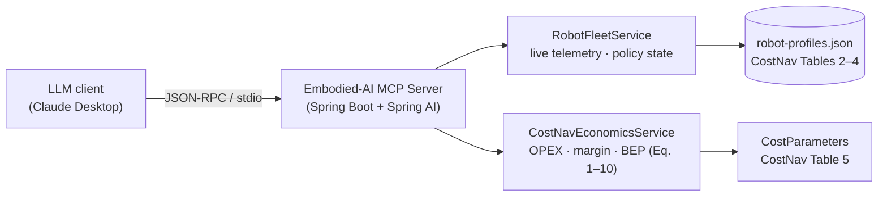

# Embodied-AI MCP Server — a cost-aware agent harness for delivery robots

> An **MCP (Model Context Protocol) server** that lets an LLM inspect a physical
> delivery robot's state and reason about its **economic viability**, using the
> cost model from **[CostNav](https://arxiv.org/abs/2511.20216)** (Seong et al.,
> SNU / MAUM.AI / KAIST / UC Irvine).
>
> Built with **Spring Boot 4** + **Spring AI 2.0**. Plugs directly into Claude
> Desktop or any MCP client over stdio.

Navigation research scores robots on *task success* (success rate, collision
rate, path length). CostNav's key insight is that task success **does not imply
economic viability** — every evaluated baseline loses money per delivery once you
price in electricity, repairs, refunds, pedestrian-injury liability and property
damage.

This project turns that economic model into a **tool surface an LLM can drive**:
the agent asks *"how is the robot doing?"*, the server returns physics-grounded
telemetry and a CostNav cost breakdown, and the agent reasons about what to
change. It is a small, focused demonstration of **agent-harness engineering** —
wiring an LLM to understand and act on physical-world data — rather than robotics
hardware.

---

## Architecture



The LLM never sees the formulas — it sees **tools**. It composes them to answer
open-ended questions (*"Compare every policy and tell me which loses the least
money, and why."*).

---

## The 6 MCP tools

| Tool | What it returns | Grounded in |
|------|-----------------|-------------|
| `get_robot_status` | Live telemetry: active policy, battery, position, distance/runtime, per-run collision log | Sim logs (Table 2) |
| `list_navigation_policies` | All 7 baselines with SLA, OPEX and contribution margin | Table 3 |
| `set_active_policy` | Switches the robot's navigation policy and returns new state | — |
| `get_opex_breakdown` | Per-run OPEX split into the 5 CostNav categories + dominant cost driver | §3.1.3, Eq. (6)–(10) |
| `get_economic_viability` | CAPEX, OPEX, revenue, contribution margin, break-even point | Eq. (1)–(3) |
| `recommend_navigation_policy` | Least-loss policy + concrete behaviours to cut OPEX | §4.2 |

---

## The economic model (and why it's faithful)

The server **recomputes** each cost component from CostNav's real-world
parameters (Table 5: SEC filings, AIS injury reports, commercial delivery
pricing) rather than hard-coding outputs. For example:

- **Service compensation** `= spoiled·$31.93 + (timeout + physAssist)·$3.49` — Eq. (8)
- **Repair** `= (P_robot / 18250)·0.15·(physAssist / 0.002)` — Eq. (7)
- **Revenue** `= $3.49 · SLA`, **Margin** `= Revenue − OPEX` — Eq. (1)–(2)

These reproduce the paper's published figures **to the decimal**. The unit test
[`CostNavEconomicsServiceTest`](src/test/java/ai/costnav/mcp/CostNavEconomicsServiceTest.java)
asserts it:

| Policy | OPEX/run | Revenue/run | Contribution margin | Paper (Table 3) |
|--------|---------:|------------:|--------------------:|----------------:|
| CANVAS (RGB+GPS) | $30.85 | $2.44 | **−$28.40** | −$28.40 ✓ |
| Nav2 w/ AMCL | $45.57 | $1.50 | **−$44.07** | −$44.07 ✓ |
| NavDP (least loss) | $15.75 | $0.00 | **−$15.75** | −$15.75 ✓ |

> **No baseline is economically viable** — exactly CostNav's headline finding.
> The server reports loss-minimization, never fake profitability.

---

## Demo: an LLM reasoning about robot economics

A representative Claude Desktop session (tool calls + real server responses):

> **User:** How is the delivery robot doing economically right now?

🔧 `get_robot_status` →
```json
{ "activePolicyName": "CANVAS (RGB + GPS)", "batteryPercent": 72.0,
  "position": {"x":120.0,"y":60.0}, "collisionsThisRun": 2,
  "recentCollisions": [
    {"obstacleType":"pedestrian","deltaVMps":0.41,"estimatedCostUsd":14.38},
    {"obstacleType":"property_infrastructure","deltaVMps":0.21,"estimatedCostUsd":6.0}]}
```
🔧 `get_economic_viability` →
```json
{ "opexPerRunUsd": 30.85, "revenuePerRunUsd": 2.44,
  "contributionMarginUsd": -28.40, "economicallyViable": false,
  "breakEvenRuns": null,
  "verdict": "NOT economically viable: each delivery loses $28.40 ..." }
```
🔧 `get_opex_breakdown` → `largestComponent: "pedestrianSafety" ($14.38/run)`

> **Claude:** The robot is running the CANVAS policy and is operational (72%
> battery), but it is **losing $28.40 per delivery**. Revenue is only $2.44/run
> while OPEX is $30.85/run. The single biggest cost driver is **pedestrian-safety
> liability ($14.38/run)**, which scales with collision impact speed — this run
> already logged a pedestrian contact at 0.41 m/s. To cut losses, the most
> effective lever is reducing impact delta-v near pedestrians. Note that, per the
> CostNav benchmark, *no* available policy is profitable; the least-loss option is
> NavDP at −$15.75/run.

> 📸 *Add your own screenshot of this conversation in Claude Desktop here
> (`docs/demo.png`).*

Reproduce it yourself without Claude Desktop:

```bash
python scripts/smoke_test.py
```

---

## Quickstart

**Requirements:** Java 17+ (no Gradle install needed — uses the wrapper).

```bash
# 1. Build the executable jar
./gradlew bootJar          # Windows: gradlew.bat bootJar

# 2. Verify the economic model reproduces the paper
./gradlew test

# 3. Smoke-test the full MCP handshake + all 6 tools
python scripts/smoke_test.py
```

### Connect to Claude Desktop

Add to `%APPDATA%\Claude\claude_desktop_config.json` (Windows) or
`~/Library/Application Support/Claude/claude_desktop_config.json` (macOS) — see
[`docs/claude_desktop_config.example.json`](docs/claude_desktop_config.example.json):

```json
{
  "mcpServers": {
    "embodied-ai-costnav": {
      "command": "java",
      "args": ["-jar", "/absolute/path/to/embodied-ai-mcp-server-0.0.1-SNAPSHOT.jar"]
    }
  }
}
```

Restart Claude Desktop and ask: *"How is the delivery robot doing economically?"*

---

## Project structure

```
src/main/java/ai/costnav/mcp/
├── config/CostParameters.java        # CostNav Table 5 cost parameters
├── model/                            # records: profiles, state, OPEX, viability…
├── service/
│   ├── RobotFleetService.java        # loads policies, holds state, synthesizes telemetry
│   └── CostNavEconomicsService.java  # OPEX / revenue / margin / BEP (Eq. 1–10)
└── tools/RobotStatusTools.java       # @McpTool surface (6 tools)
src/main/resources/
├── robot-profiles.json               # 7 baselines, CostNav Tables 2–4
└── logback-spring.xml                # file-only logging (stdout reserved for MCP)
```

## Faithfulness & scope

- **Paper-faithful:** every economic figure is reproduced from CostNav's
  parameters and verified by tests.
- **Operational layer (ours):** battery and map position are *not* CostNav
  metrics — CostNav explicitly lists battery depletion as out-of-scope (§6). They
  are surfaced here as an operational extension and clearly labelled as such.
- **Measured-in-sim inputs:** pedestrian-safety cost (AIS model, Eq. 9) and
  property-damage cost (Eq. 10) are taken as measured per-policy values; the other
  three OPEX components are recomputed from first principles.

## Citation

```bibtex
@article{seong2026costnav,
  title   = {CostNav: A Navigation Benchmark for Real-World Economic-Cost
             Evaluation of Physical AI Agents},
  author  = {Seong, Haebin and others},
  journal = {arXiv preprint arXiv:2511.20216},
  year    = {2026}
}
```

This repository is an independent educational reimplementation of CostNav's
economic model as an MCP tool surface. All credit for the benchmark and cost
model belongs to the CostNav authors — see
[worv-ai/CostNav](https://github.com/worv-ai/CostNav).

---

## 한국어 요약

LLM이 **물리 배달로봇의 상태를 조회하고 경제성(흑자/적자)을 판단**하도록 돕는
**MCP 서버**입니다. 비용 모델은 서울대 등이 발표한 **CostNav** 논문에서 가져왔습니다.

- **Spring Boot 4 + Spring AI 2.0**, stdio로 Claude Desktop에 바로 연결됩니다.
- 6개 도구(상태조회·정책비교·정책전환·OPEX분해·경제성판단·정책추천)를 노출합니다.
- 전기·수리·서비스보상·보행자안전·재물손괴 5개 OPEX 항목을 논문 파라미터(Table 5)로
  **직접 계산**해, 논문 Table 3의 수치(CANVAS 마진 −$28.40 등)를 **소수점까지 재현**합니다
  (테스트로 검증).
- 핵심 메시지: 로봇 하드웨어가 아니라, **LLM을 물리세계 데이터에 연결하는 에이전트
  하네스 엔지니어링**을 구현했습니다.

실행: `./gradlew bootJar` → `./gradlew test` → `python scripts/smoke_test.py`
